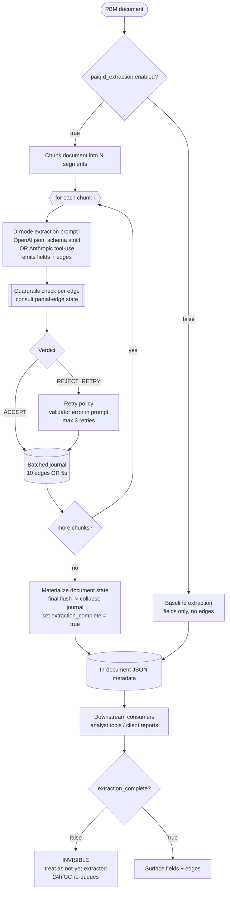
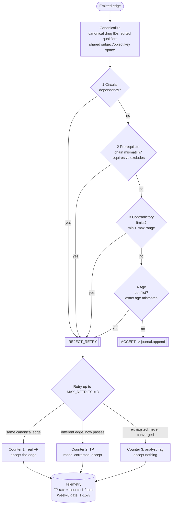
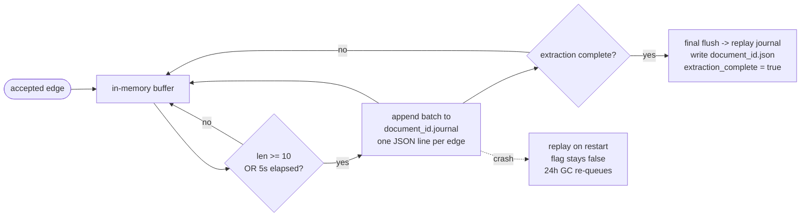
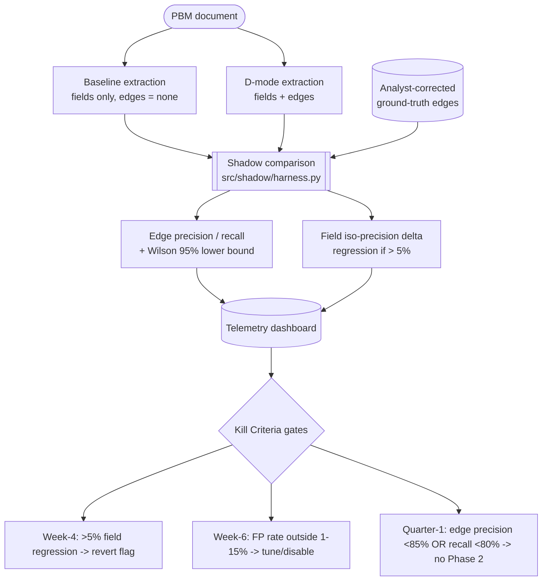
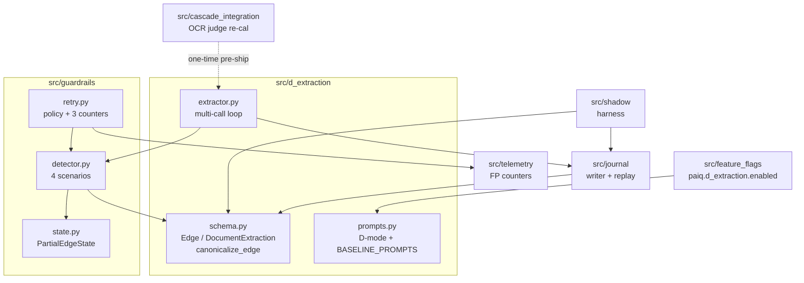

# Workflow — PAIQ Idea 11.3 Phase 1 (Approach D + Guardrails)

How relationship-aware extraction (Approach D) and extraction-time guardrails
work end to end. These diagrams render natively on GitHub.

Source of truth for each box is cited as `module` so the diagram stays honest
against the code:

- `src/d_extraction/` — Pydantic edge schema + provider structured-output prompts
- `src/guardrails/` — 4 detectors, retry policy, 3-counter FP telemetry, canonicalization
- `src/journal/` — batched-write journal + crash-recovery replay
- `src/feature_flags/` — `paiq.d_extraction.enabled`
- `src/shadow/` — D-output vs analyst ground-truth comparison
- `src/telemetry/` — FP-rate counters / observability
- `src/cascade_integration/` — cascade-OCR judge re-calibration

---

## 1. End-to-end pipeline (happy path)

A PBM document is chunked. Each chunk is extracted via provider built-in
structured outputs, every emitted edge is checked by guardrails BEFORE the next
chunk commits (D10 multi-turn protocol), accepted edges are journaled, and the
document is only materialized (and made visible downstream) once all chunks pass
and `extraction_complete` is set true.

---

## 2. The guardrails loop (per emitted edge)

The detector runs four scenarios in a fixed order; the first hit short-circuits
to `REJECT_RETRY`. On rejection, the retry policy asks the model to re-extract
with the validator error attached, and classifies the outcome into one of three
mutually exclusive FP-telemetry counters.

---

## 3. Journal write path (D7 — persist-as-you-go)

Accepted edges land in an in-memory buffer flushed to a per-document journal file
every 10 edges OR 5 seconds. On completion the journal is replayed and collapsed
into canonical JSON. A crash mid-document leaves `extraction_complete=false`, so
the partial row is invisible downstream and is GC'd / re-queued after 24h.

---

## 4. Shadow path (how we measure D before it ships)

Runs in parallel with the production pipeline. Baseline (existing prompts) and
D-mode run on the same document; the harness computes edge precision/recall vs
analyst-corrected ground truth (Quarter-1 gate) and iso-precision regression on
existing fields (Week-4 gate). Wilson lower bounds defend the gates against
small-N point-estimate noise.

---

## 5. Module boundaries

Who owns what, and the one-directional dependencies between modules.

---

## Key invariants

- Provider structured outputs enforce **shape, not semantics** — a schema-valid
  edge can still be logically wrong. Guardrails + the eval suite are the semantic
  defense, not the schema.
- Guardrails fire **after each LLM call, before the next chunk commits** (D10).
- `extraction_complete=false` rows are **invisible** to downstream consumers and
  GC'd after 24h (D12).
- FP rate is **counter 1 / total** with canonicalization (D4); the Week-6 gate is
  1-15%.
- The feature flag `paiq.d_extraction.enabled` is the **instant-revert** path; the
  baseline prompt path stays in the code.
